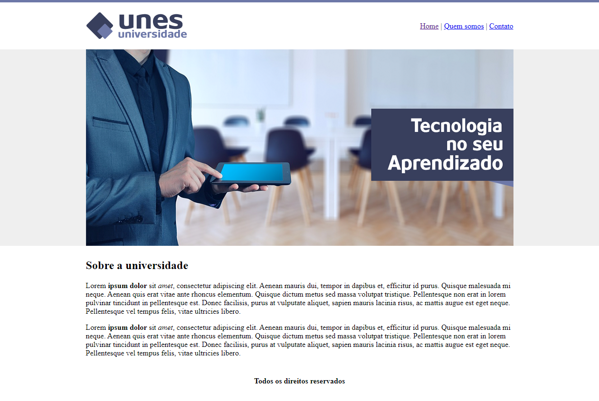

# Universidade Unes
> Primeiro projeto acadêmico.

Este é o meu primeiro projeto como desenvolvedor web, escrito em HTML puro, se trata de um site para uma 
universidade fictícia. 

Projeto desenvolvido no curso de __Desenvolvimento web completo__, abordando os princípios da linguagem HTML. 

## Meta

Paulo Marques - [@prmarquesz](https://twitter.com/prmarquesz) - paulormarques.dev@gmail.com

Udemy - [Curso de Desenvolvimento Web completo](https://www.udemy.com/course/web-completo/)